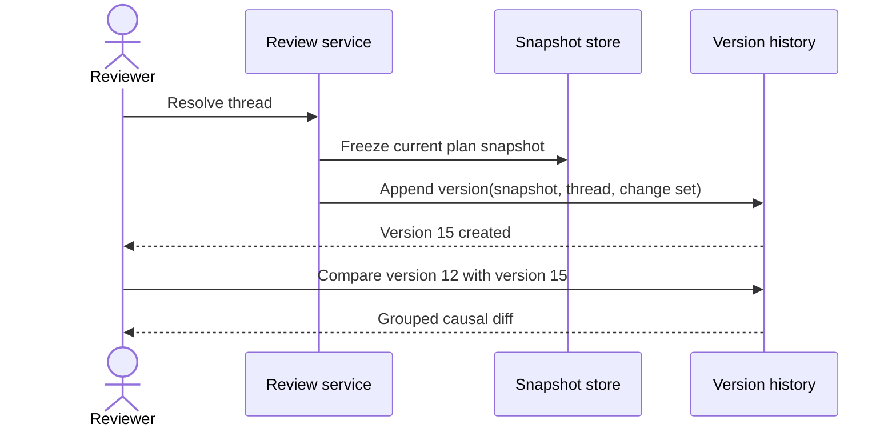

# Versioned Plan History

Turn resolved review threads into named plan versions that reviewers can inspect, compare, and restore.

<QuickSummary>

<Why>

- Reviewers need a durable way to understand how a plan evolved and recover a trusted earlier state.

</Why>

<What>

- Create one immutable version whenever a comment thread resolves, then expose version history, comparisons, and restore from the review toolbar.

</What>

<How>

- Attach immutable version records to existing plan snapshots.
- Capture the resolving thread and its change set on each record.
- Expose read and restore contracts behind a history workspace.

</How>

</QuickSummary>

<TableOfContents>
<Entry section="Version lifecycle" gist="Define when versions are created and what each record preserves" />
<Entry section="History workspace" gist="Review, compare, and restore versions without leaving the plan" />
<Entry section="Storage and service contracts" gist="Persist immutable labels and expose narrow read and restore APIs" />
<Entry section="Delivery and verification" gist="Roll out safely and prove history remains trustworthy" />
</TableOfContents>

<Part title="Product contract" />

## Version lifecycle

*A version is a durable label on an existing immutable plan snapshot, not a second copy of the plan.*

<Callout type="note" title="Vocabulary">

A **change** is one revision to the plan. A **change set** is the zero or more
changes attributed to one comment thread. A **diff** is the Was/Now presentation
used to inspect one change. A **version** labels the plan snapshot produced when
that thread resolves.

</Callout>

<FlowDiagram>

<Stage title="Review">
<Node id="open-thread" label="Open thread" code="version 14" tone="source" />
</Stage>

<Stage title="Inspect">
<Node id="change-set" label="Review change set" code="0..n changes" />
</Stage>

<Stage title="Conclude">
<Node id="resolve-thread" label="Resolve thread" code="atomic action" />
</Stage>

<Stage title="History">
<Node id="version-created" label="Create version 15" code="snapshot + thread" tone="destination" />
</Stage>

<Edge from="open-thread" to="change-set" label="agent responds" />
<Edge from="change-set" to="resolve-thread" label="reviewer concludes" />
<Edge from="resolve-thread" to="version-created" label="labels result snapshot" />

Every resolved thread advances history once, including each thread resolved from a submitted batch.

</FlowDiagram>

<MermaidDiagram>



Resolution and version creation share one transaction boundary, so a resolved thread can never exist without its version.

</MermaidDiagram>

<Decision question="What creates a version?">

A predictable rule matters more than keeping the initial version count small.

<Option title="Every resolved thread" recommended summary="Create one version for each concluded review conversation.">

<Consideration label="Causality" verdict="Preserved" tone="good">

The version points to exactly one thread and its change set, so its reason is always reviewable.

</Consideration>

<Consideration label="Volume" verdict="Potentially high" tone="mixed">

A batch of five independently resolved comments produces five versions, which the history workspace must scan and filter well.

</Consideration>

</Option>

<Option title="Every submitted batch" summary="Create one version after all comments from a batch resolve.">

<Consideration label="Causality" verdict="Blurred" tone="bad">

One label would combine multiple conversations that can finish at different times or with different outcomes.

</Consideration>

<Consideration label="Volume" verdict="Medium" tone="mixed">

One version per batch is steady and predictable, but the shorter list hides meaningful review boundaries.

</Consideration>

</Option>

<Option title="Every thread that changed the plan" summary="Create a version only when a resolved thread produced at least one change.">

<Consideration label="Causality" verdict="Preserved" tone="good">

Each version still points to exactly one thread, and a version never labels a snapshot identical to the one before it.

</Consideration>

<Consideration label="Volume" verdict="Lowest" tone="good">

Answered and declined threads leave no version, so history holds only the states a reviewer could meaningfully restore.

</Consideration>

</Option>

</Decision>

<Callout type="warning" title="Release labels come later">

Versions are intentionally frequent and mechanical. A future release concept may label selected versions with a higher-order milestone such as “Release 1”; releases are out of scope here.

</Callout>

## History workspace

*The toolbar shows the current version and opens a full-screen workspace for browsing immutable history.*

The toolbar selector reads **Version 15** for the latest plan. Opening it presents
all versions newest-first. Each row shows its timestamp, resolved thread, outcome,
change count, and author. Selecting a row opens the complete read-only thread and
the diff from the preceding version.

<Wireframe id="version-history" title="Full-screen version history">

<Screen id="history" name="Version history" device="desktop" url="/plans/causal-diffs/versions">

<AppShell>

<Sidebar brand="Version history" mode="15 versions">

<Nav label="Versions">
<NavItem label="Version 15 · Just now · 1 change" active />
<NavItem label="Version 14 · 12m ago · no changes" />
<NavItem label="Version 13 · 31m ago · 3 changes" />
</Nav>

</Sidebar>

<AppContent>

<PageHeader title="Version 15">
<Badge label="Current" tone="success" />
<Button label="Compare versions" emphasis="secondary" />
<Button label="Restore this version" emphasis="primary" />
</PageHeader>

<Row gap="md">

<Panel title="Resolved thread" surface="filled">
<Text text="Delivery contract" role="section" />
<Text text="“Make the snapshot boundary explicit.”" />
<Text text="Resolved by Josh · just now" role="muted" />
<Divider />
<Text text="The agent attached one changed table row and the reviewer accepted it before resolving the thread." />
</Panel>

<Panel title="Compared with version 14" surface="filled">
<Text text="1 change" role="section" />
<Text text="Delivery contract · snapshot boundary reworded" />
<Button label="Review diff" emphasis="secondary" />
</Panel>

</Row>

</AppContent>

</AppShell>

</Screen>

</Wireframe>

<Callout type="warning" title="Restore creates history; it never erases it">

Restoring version 11 writes that snapshot as a new current plan and creates version 16. Versions 12 through 15 remain immutable and visible, so recovery cannot rewrite the audit trail.

</Callout>

<Part title="Implementation contract" />

## Storage and service contracts

*Version metadata points at existing immutable snapshots and the review event that caused the label.*

<DatabaseTableSchema name="review.plan_versions">

```dbml
id                   bigint      [pk, increment]
plan_id              text        [not null]
version_number       integer     [not null, check: 'version_number > 0']
snapshot_id          bigint      [not null, ref: > review.plan_snapshots.id]
resolved_thread_id   text        [not null]
resolution_event_id  bigint      [not null]
restored_from_id     bigint      [ref: > review.plan_versions.id]
created_at           timestamptz [not null, default: `now()`]

indexes {
  (plan_id, version_number) [unique, name: 'plan_versions_number_idx']
  (plan_id, created_at) [name: 'plan_versions_history_idx']
  resolved_thread_id [unique, name: 'plan_versions_thread_idx']
}

Note: 'One immutable version label per resolved thread; snapshot_id is a numeric foreign key and snapshot bytes remain owned by the snapshot store.'
```

</DatabaseTableSchema>

<HttpEndpoint method="GET" path="/api/plans/{planId}/versions" summary="List plan versions" auth="Local review session">

Returns immutable versions newest-first with enough thread and change-set metadata to render the history list. Thread messages and snapshot bodies load only when a version is opened.

<Param name="planId" in="path" type="string" required>

Stable identifier for the authoritative plan source.

</Param>

<Param name="cursor" in="query" type="string">

Opaque cursor for the next page of older versions.

</Param>

<Response status="200" label="Versions listed">

```json
{
  "versions": [
    {
      "number": 15,
      "snapshotId": 4821,
      "resolvedThreadId": "thr_01K2A5YJ0F",
      "outcome": "changed",
      "changeCount": 1,
      "createdAt": "2026-08-11T20:31:04.121Z"
    }
  ],
  "nextCursor": "v14"
}
```

</Response>

</HttpEndpoint>

<HttpEndpoint method="POST" path="/api/plans/{planId}/versions/{version}/restore" summary="Restore a historical version" auth="Local review session">

Restores the selected snapshot as a new current plan after explicit confirmation. The response reports the newly created version rather than mutating the historical record. Restore never rewrites or merges history: the caller states the current version it confirmed against, and the server rejects the request if the plan moved on.

<Param name="planId" in="path" type="string" required>

Stable identifier for the authoritative plan source.

</Param>

<Param name="version" in="path" type="integer" required>

Historical version to restore.

</Param>

<Param name="expectedCurrentVersion" in="body" type="integer" required>

Current version the reviewer confirmed against. The server restores only when this still matches, so a concurrent edit or an unresolved thread produces a 409 instead of silently discarding it.

</Param>

<Response status="201" label="Version restored">

```json
{
  "restoredFrom": 11,
  "currentVersion": 16,
  "snapshotId": 4833
}
```

</Response>

<Response status="409" label="Plan changed before restore">

```json
{
  "error": "current_version_conflict",
  "expectedCurrentVersion": 15,
  "actualCurrentVersion": 16
}
```

</Response>

</HttpEndpoint>

<GraphqlOperation kind="query" name="planVersions" access="Requires plan read access" />

<GrpcMethod service="bigplan.v1.VersionService" name="WatchVersions" request="WatchVersionsRequest" response="PlanVersion" kind="serverStreaming" />

<FileTreeDiff title="Version history slice">

```tree
src/
  review/
    versions/ [added] - Version lifecycle and repository contracts.
      service.ts [added] - Creates, lists, compares, and restores versions.
      repository.ts [added] - Appends immutable version labels.
  render/
    shell/
      version-history.browser.tsx [added] - Full-screen history workspace.
      review-controller.browser.tsx [modified] - Toolbar selector and resolve hook.
test/
  version-history.spec.ts [added] - Exercises list, compare, and restore journeys.
docs/
  src/content/docs/intro/version-history.md [added] - Explains versions and restore behavior.
```

</FileTreeDiff>

<Part title="Delivery" />

## Delivery and verification

*Ship the immutable lifecycle first, then expose comparison and restore behind a local feature flag.*

1. Add the repository transaction that resolves a thread and appends its version atomically.
2. Add paginated version reads and lazy thread/snapshot loading.
3. Add the toolbar selector and full-screen history workspace.
4. Add adjacent-version and arbitrary two-version comparisons.
5. Add restore-as-new-version with explicit confirmation and conflict protection.

<DataTable title="Acceptance journeys">

```table
| Journey | Expected evidence |
| --- | --- |
| Resolve one changed thread | One new version points to its result snapshot and change set |
| Resolve five batched threads | Five ordered versions exist, one per resolution |
| Resolve an answered thread | A version exists with an empty change set and full thread history |
| Compare versions 8 and 15 | The workspace renders every intervening plan difference |
| Restore version 11 | Version 16 becomes current and records `restoredFrom: 11` |
| Reload or restart review | Version numbers, threads, and snapshot links remain stable |
```

</DataTable>

<Callout type="note" title="Verification">

Unit-test version numbering, transaction rollback, comparison selection, and restore conflicts. Add browser journeys for one, two, and many versions; keyboard navigation; long threads; empty change sets; and read-only historical threads. Finish with `bun run build`, `bun run lint`, and the focused Playwright version-history suite.

</Callout>
