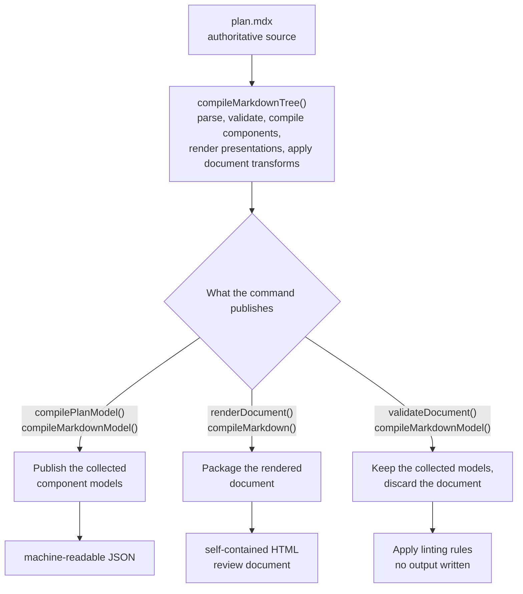
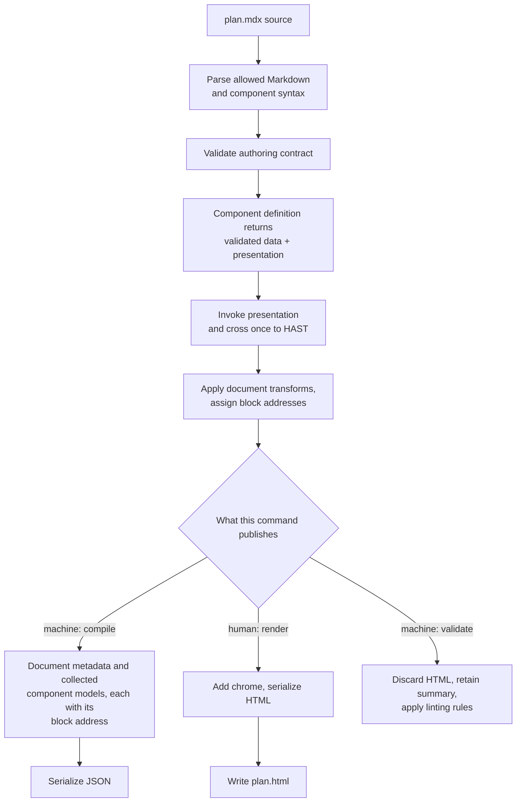

Big Plan's central architectural idea is to treat an authored plan like source code rather than an HTML template.
Before Big Plan chooses an output format, it **compiles** the plan.

Compilation here does not mean generating machine code.
It means reading the authored MDX, rejecting code or component usage outside Big Plan's plan format, and translating each built-in component into plain validated data.

The compiler is not one class or executable inside Big Plan.
It is the coordinated translation path made from the MDX parser, authoring validators, and the compilation function owned by each built-in component.
A component's compilation function knows how to turn that component's attributes and children into validated data; it does not decide whether the final delivery is JSON or HTML.

That shared translation is what keeps validation and both outputs consistent:

- `big-plan compile` collects document metadata and validated component data into machine-readable JSON.
- `big-plan render` presents that same validated component data inside a human-readable HTML review document.
- `big-plan validate` renders the plan in memory while collecting the machine-readable summary, then applies linting rules to the authored plan without writing either output.

The commands run independently, and no command reads output produced by another.
They agree because each starts from the authoritative source file and reuses the same parsing, validation, and component-compilation implementation.

In the source, `compileMarkdownModel()` and `compileMarkdown()` are thin entry points over `compileMarkdownTree()`.
That function coordinates the compilation path described above.
It is shared code executed separately by each command, not a cached intermediate artifact or a process that emits output files together.

## Plans are MDX

A plan is an MDX document made from Markdown and built-in components.
Imports, exports, expressions, and inline JSX are rejected.
A plan is prose plus components, nothing else.
That keeps every plan greppable and diffable, which the review workflow depends on, and it means the renderer never has to run code an agent wrote.
The full contract lives in [Authoring plans](/for-agents/authoring-plans/) and [Linting rules](/reference/lint-rules/).

## Slide vocabulary is shared data

Recurring slide roles live in a framework-free catalog below component compilation, lint, and rendering.
Each type owns its stable id and name together with the matching boundary, authoring guidance, component pairings, and cardinality that give the type value.
The [`Slide`](/components/slide/) compiler validates an authored marker against that catalog, the deck transform derives structural names from it, lint reads only its objective facts, and guidance generation returns the same records to agents.
One file per type keeps catalog growth an ordinary reviewed contribution rather than a new architecture decision.

## Each component compiles once and both deliveries render it

The [built-in components](/components/) come from a closed registry.
When `compileMarkdownTree()` reaches a registered component, its definition validates the authored input and returns two things: plain validated data and a React presentation function closed over that data.
The component is compiled once during that command invocation, and both deliveries then do the same thing with what it returned: they give the validated data to the component's React view, cross one React-to-HAST boundary, replace the authored component node with plain document HAST, and apply the same document-wide transforms.
Only what each delivery publishes differs:

- **Machine delivery**, used by `big-plan compile` and `big-plan validate`, publishes the collected component models.
  It renders for the same reason: each published model carries the block address its rendered root was given, and a block address only exists over a finished deck.
  That address is present only where the component's root became a block a reader can point at, so a component rendered privately inside another component's markup, and a slide, which is a scope rather than a block, each publish a model with no address.
  Validation keeps that summary, discards the generated document, and applies its registered linting rules to the authored plan.
- **Human delivery**, used by `big-plan render`, packages the rendered result as the self-contained inert HTML review document.

The two differ in exactly one other respect, and it is a consequence of what they publish rather than a separate decision: under machine delivery a component's model carries its nested components' presentation instead of a deferred placeholder, because no later pass reaches a placeholder that only a model holds.

All three commands therefore agree on component semantics because they call the same compilation function, not because one consumes another command's output.
No plan-authored code is evaluated or shipped.
Ordinary Markdown prose participates only in the human document, while its heading metadata remains available in the machine-readable JSON.

An invalid document never renders partially.
Validation collects every recoverable problem, including unknown components, bad attributes, and malformed fences, and fails with the complete list, each entry carrying a `line:column` position, so an agent can fix those problems in one pass.
An MDX syntax error can stop parsing before component validation begins, so fix that reported error and render again.

## The HTML review document is self-contained

The rendered document embeds everything it needs, makes no external requests, and works offline.
See the [two-artifact delivery ADR](https://github.com/josh-padnick/big-plan/blob/main/adr/0001-two-artifact-plan-delivery.md) for the authoritative artifact definitions and script-dependent behavior.
Rendering the static artifact touches no server, account, or other machine.
The live `review` command adds a loopback runtime with a per-session API token so the browser and local coding agent can exchange comments, progress, and responses; its owner-only state remains beside the plan on the reviewer's machine.
