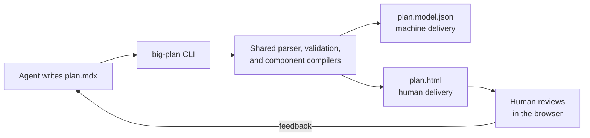
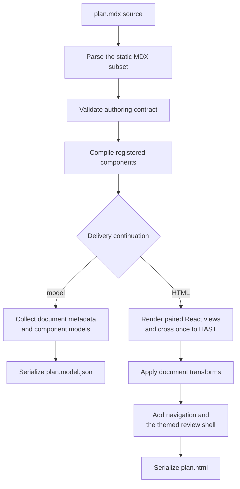

Big Plan is a deliberately small pipeline: a CLI, a shared compiler, and two derived outputs.
Your agent writes the plan, then either compiles its machine-readable model or renders its human review document; the source file on your disk remains authoritative.

## Plans are MDX

A plan is an MDX document, but only a deliberately static subset of MDX is accepted: no imports, no exports, no expressions, and no inline JSX.
A plan is prose plus components, nothing else.
That keeps every plan greppable and diffable, which the review workflow depends on, and it means the renderer never has to run code an agent wrote.
The full contract lives in [Authoring plans](/for-agents/authoring-plans/).

## Components compile before delivery

[`BigDecision`](/components/big-decision/), [`Callout`](/components/callout/), [`CodeDiff`](/components/code-diff/), [`CodeSnippet`](/components/code-snippet/), [`DatabaseTableSchema`](/components/database-table-schema/), [`FileTree`](/components/file-tree/), [`FileTreeDiff`](/components/file-tree-diff/), [`GraphqlOperation`](/components/graphql-operation/), [`GrpcMethod`](/components/grpc-method/), [`HttpEndpoint`](/components/http-endpoint/), and [`SmallDecisionSet`](/components/small-decision-set/) come from a closed, built-in registry.
When the compiler meets a component, its definition produces a framework-neutral model paired with a React presentation that consumes that model.
The `compile` command collects the models in source order without top-level presentation.
The `render` command invokes the paired presentations, crosses one React-to-HAST boundary, and continues as plain document HTML; no plan-authored code is evaluated or shipped.
Ordinary Markdown prose participates only in the human document, while its heading metadata remains available in the machine model.

An invalid document never renders partially.
Validation collects every recoverable problem, including unknown components, bad attributes, and malformed fences, and fails with the complete list, each entry carrying a `line:column` position, so an agent can fix those problems in one pass.
An MDX syntax error can stop parsing before component validation begins, so fix that reported error and render again.

## The HTML review document is self-contained

The rendered document embeds everything it needs: styles, branding, and favicons.
It ships no scripts, makes no external requests, and works offline; navigation uses native anchors and disclosures, while the OS color-scheme preference controls the palette through CSS.
Nothing about rendering or reviewing a plan touches a server, an account, or anyone else's machine.
