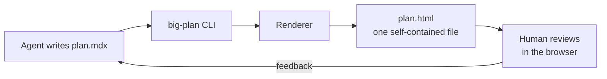
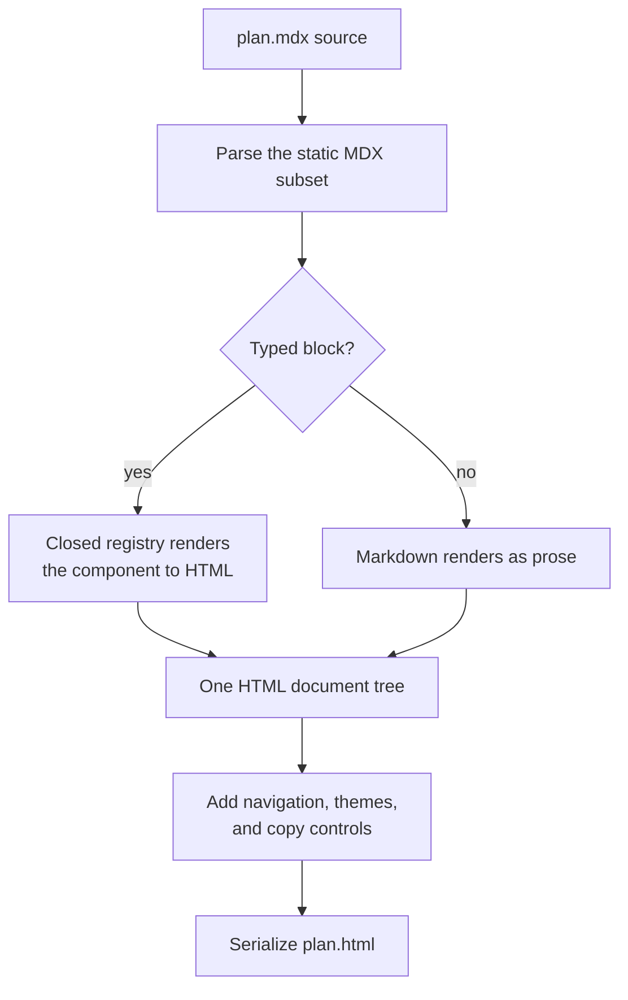

Big Plan is a deliberately small pipeline: a CLI, a pure renderer, and one output file.
Your agent writes the plan, you render it, you review it, and the file on your disk stays the source of truth the whole time.

## Plans are MDX

A plan is an MDX document, but only a deliberately static subset of MDX is accepted: no imports, no exports, no expressions, and no inline JSX.
A plan is prose plus typed blocks, nothing else.
That keeps every plan greppable and diffable, which the review workflow depends on, and it means the renderer never has to run code an agent wrote.
The full contract lives in [Authoring plans](/for-agents/authoring-plans/).

## Components render to HTML

Typed blocks like [`Callout`](/components/callout/) and [`CodeDiff`](/components/code-diff/) come from a closed, built-in registry.
When the renderer meets a typed block, the registry renders it to plain HTML on the server: the component's markup and styles are baked into the output document, no plan-authored code is evaluated or shipped, and built-in scripts provide only progressive enhancement.
Everything else renders as ordinary markdown prose.

An invalid document never renders partially.
Validation collects every problem, unknown blocks, bad attributes, malformed fences, and fails with the complete list, each entry carrying a `line:column` position, so an agent can fix everything in one pass.

## One self-contained file

The rendered document embeds everything it needs: styles, scripts, branding, and favicons.
It makes no external requests, works offline, and stays readable with JavaScript disabled; scripts only enhance navigation, theme switching, code-copy controls, and `CodeDiff` views, annotations, actions, and full-screen mode.
Nothing about rendering or reviewing a plan touches a server, an account, or anyone else's machine.

## What comes next

A local review server will connect the rendered plan back to the authoring agent for comments and live chat.
How the server is notified when you give feedback belongs to that chapter of the architecture; until it ships, the flow above is the whole story.
