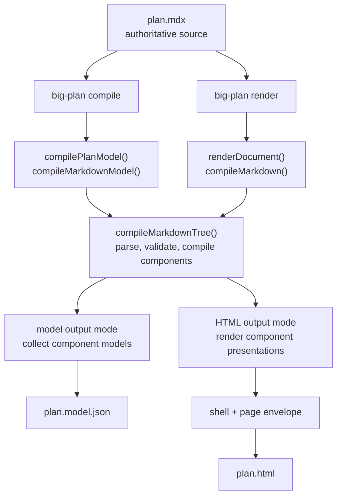
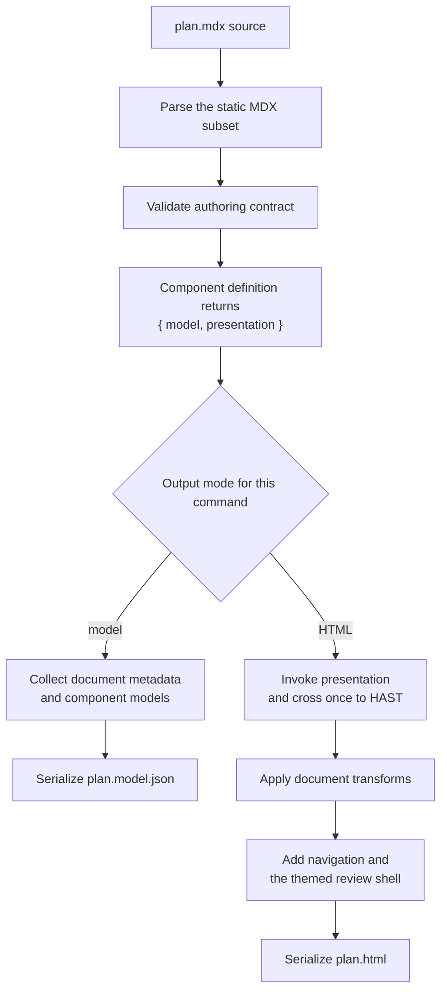

Big Plan's central architectural idea is to treat an authored plan like source code rather than an HTML template.
Before Big Plan chooses an output format, it **compiles** the plan.

Compilation here does not mean generating machine code.
It means reading the authored MDX, rejecting syntax or component usage outside Big Plan's static contract, and translating each registered component into validated, framework-neutral data.
That data is the component's **model**: the meaning of what the author wrote, separated from how a human sees it.

The compiler is not one class or executable inside Big Plan.
It is the coordinated translation path made from the MDX parser, authoring validators, and the compiler owned by each registered component.
A component compiler knows how to turn that component's attributes and children into its model; it does not decide whether the final delivery is JSON or HTML.

This intermediate model is what makes two outputs possible:

- `big-plan compile` collects the document metadata and component models into machine-readable JSON.
- `big-plan render` presents those same component models inside a human-readable HTML review document.

The commands run independently.
Running one does not run the other, and `render` never reads JSON produced by `compile`.
They agree because each starts from the authoritative source file and reuses the same parsing, validation, and component-compilation implementation.

In the source, `compileMarkdownModel()` and `compileMarkdown()` are thin entry points over `compileMarkdownTree()`.
That function coordinates the compilation path described above.
It is shared code executed separately by each command, not a cached intermediate artifact or a process that emits both files at once.

## Plans are MDX

A plan is an MDX document, but only a deliberately static subset of MDX is accepted: no imports, no exports, no expressions, and no inline JSX.
A plan is prose plus components, nothing else.
That keeps every plan greppable and diffable, which the review workflow depends on, and it means the renderer never has to run code an agent wrote.
The full contract lives in [Authoring plans](/for-agents/authoring-plans/).

## Each component compiler supports both output modes

[`BigDecision`](/components/big-decision/), [`Callout`](/components/callout/), [`CodeDiff`](/components/code-diff/), [`CodeSnippet`](/components/code-snippet/), [`DatabaseTableSchema`](/components/database-table-schema/), [`FileTree`](/components/file-tree/), [`FileTreeDiff`](/components/file-tree-diff/), [`GraphqlOperation`](/components/graphql-operation/), [`GrpcMethod`](/components/grpc-method/), [`HttpEndpoint`](/components/http-endpoint/), and [`SmallDecisionSet`](/components/small-decision-set/) come from a closed, built-in registry.
When `compileMarkdownTree()` reaches a registered component, its definition validates the authored input and returns two things: a framework-neutral model and a React presentation function closed over that model.
The component is compiled once during that command invocation; the selected output mode determines what happens next:

- In **model output mode**, used by `big-plan compile`, Big Plan collects the framework-neutral model in source order and does not invoke the top-level presentation.
- In **HTML output mode**, used by `big-plan render`, Big Plan invokes the presentation, crosses one React-to-HAST boundary, and replaces the authored component node with plain document HAST.

The two commands therefore agree on component semantics because they call the same component compiler, not because `render` consumes the JSON produced by `compile`.
No plan-authored code is evaluated or shipped.
Ordinary Markdown prose participates only in the human document, while its heading metadata remains available in the machine model.

An invalid document never renders partially.
Validation collects every recoverable problem, including unknown components, bad attributes, and malformed fences, and fails with the complete list, each entry carrying a `line:column` position, so an agent can fix those problems in one pass.
An MDX syntax error can stop parsing before component validation begins, so fix that reported error and render again.

## The HTML review document is self-contained

The rendered document embeds everything it needs: styles, branding, and favicons.
It ships no scripts, makes no external requests, and works offline; navigation uses native anchors and disclosures, while the OS color-scheme preference controls the palette through CSS.
Nothing about rendering or reviewing a plan touches a server, an account, or anyone else's machine.
