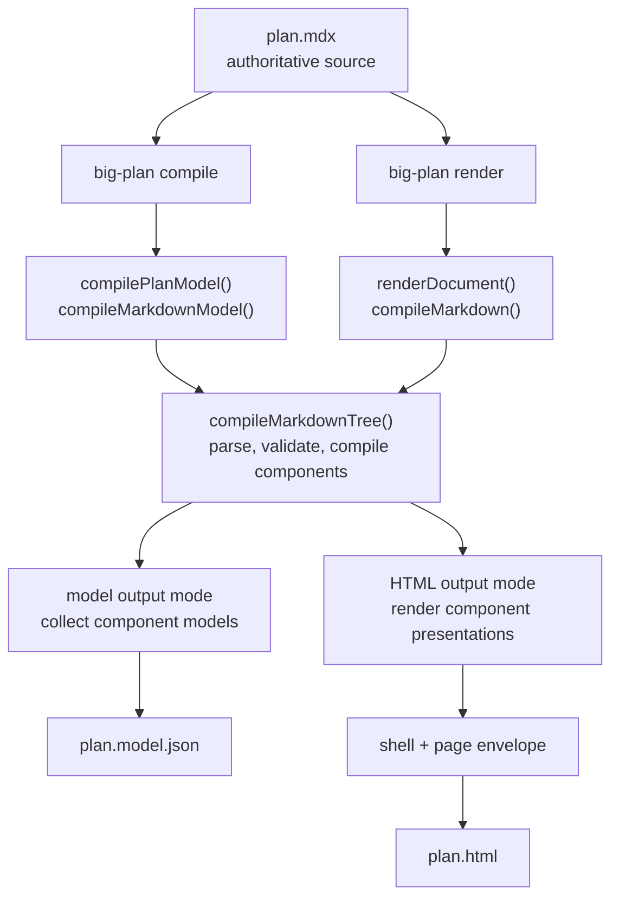
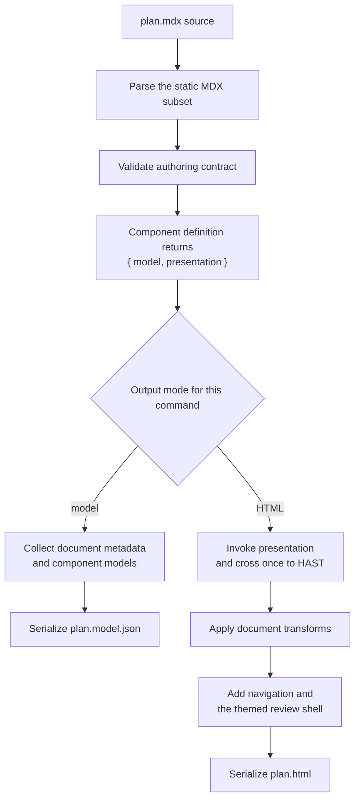

Big Plan exposes two independent commands over the same plan source.
`big-plan compile` produces a machine-readable plan model; `big-plan render` produces a human-readable review document.
Running one command does not run the other, and neither command reads the other command's output.

What they share is implementation: both parse the same static MDX subset, apply the same authoring validation, and call the same registered component compilers.
Each command starts that work from the source file, so the file on your disk remains authoritative.

In the source, `compileMarkdownModel()` and `compileMarkdown()` are thin entry points over `compileMarkdownTree()`.
That shared function is the common pipeline: shared code executed separately by each command, not a cached intermediate artifact or a process that emits both files at once.

## Plans are MDX

A plan is an MDX document, but only a deliberately static subset of MDX is accepted: no imports, no exports, no expressions, and no inline JSX.
A plan is prose plus components, nothing else.
That keeps every plan greppable and diffable, which the review workflow depends on, and it means the renderer never has to run code an agent wrote.
The full contract lives in [Authoring plans](/for-agents/authoring-plans/).

## One component compiler supports both output modes

[`BigDecision`](/components/big-decision/), [`Callout`](/components/callout/), [`CodeDiff`](/components/code-diff/), [`CodeSnippet`](/components/code-snippet/), [`DatabaseTableSchema`](/components/database-table-schema/), [`FileTree`](/components/file-tree/), [`FileTreeDiff`](/components/file-tree-diff/), [`GraphqlOperation`](/components/graphql-operation/), [`GrpcMethod`](/components/grpc-method/), [`HttpEndpoint`](/components/http-endpoint/), and [`SmallDecisionSet`](/components/small-decision-set/) come from a closed, built-in registry.
When `compileMarkdownTree()` reaches a registered component, its definition validates the authored input and returns two things: a framework-neutral model and a React presentation function closed over that model.
The component is compiled once during that command invocation; the selected output mode determines what happens next:

- In **model output mode**, used by `big-plan compile`, Big Plan collects the framework-neutral model in source order and does not invoke the top-level presentation.
- In **HTML output mode**, used by `big-plan render`, Big Plan invokes the presentation, crosses one React-to-HAST boundary, and replaces the authored component node with plain document HAST.

The two commands therefore agree on component semantics because they call the same component compiler, not because `render` consumes the JSON produced by `compile`.
No plan-authored code is evaluated or shipped.
Ordinary Markdown prose participates only in the human document, while its heading metadata remains available in the machine model.

An invalid document never renders partially.
Validation collects every recoverable problem, including unknown components, bad attributes, and malformed fences, and fails with the complete list, each entry carrying a `line:column` position, so an agent can fix those problems in one pass.
An MDX syntax error can stop parsing before component validation begins, so fix that reported error and render again.

## The HTML review document is self-contained

The rendered document embeds everything it needs: styles, branding, and favicons.
It ships no scripts, makes no external requests, and works offline; navigation uses native anchors and disclosures, while the OS color-scheme preference controls the palette through CSS.
Nothing about rendering or reviewing a plan touches a server, an account, or anyone else's machine.
