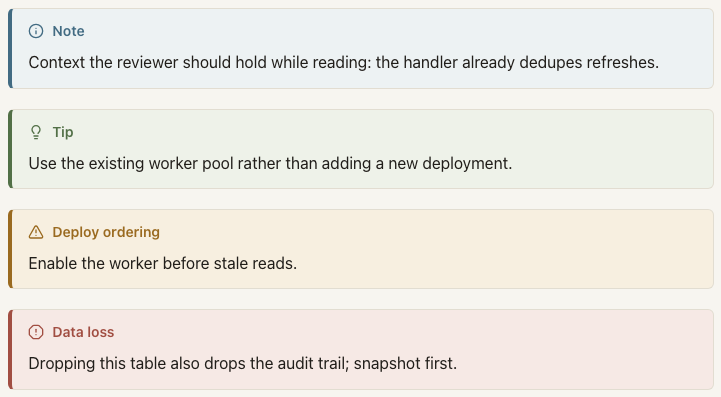

`Callout` renders an accent-bordered panel with a per-type icon and title over arbitrary Markdown children.
Use it for the sentences a reviewer must read even when skimming: review goals, deploy-ordering warnings, data-loss dangers.



## Usage

```mdx
<Callout type="warning" title="Deploy ordering">

Enable the worker before stale reads.

</Callout>
```

## Attributes

| Attribute | Type                                       | Required | Behavior                                                                |
| --------- | ------------------------------------------ | -------- | ----------------------------------------------------------------------- |
| `type`    | `"note" \| "tip" \| "warning" \| "danger"` | Yes      | Selects the accent palette, the icon, and the default title.            |
| `title`   | string                                     | No       | Header text; defaults to `Note`, `Tip`, `Warning`, or `Danger` by type. |

Any other attribute is a positional authoring error.

## Types

| Type      | Icon           | Intended use                                    |
| --------- | -------------- | ----------------------------------------------- |
| `note`    | info           | Context the reviewer should hold while reading. |
| `tip`     | lightbulb      | A better path the reviewer might not know.      |
| `warning` | triangle-alert | Something that will go wrong if ignored.        |
| `danger`  | octagon-alert  | Irreversible or destructive consequences.       |

## Children

Children are ordinary Markdown and keep every pipeline behavior: headings receive anchors, fenced code keeps syntax highlighting and its copy control, and tables keep their scroll containers.
Level-two headings inside a callout still join the document's table of contents.

## Theming and accessibility

Each type carries distinct accent and background tokens in both the light and dark palettes, and the four accents remain visually distinguishable from one another in each theme.
The icon is decorative (`aria-hidden`); the visible title text carries the meaning, so screen readers announce it naturally.
The component renders entirely server-side and needs no JavaScript.
