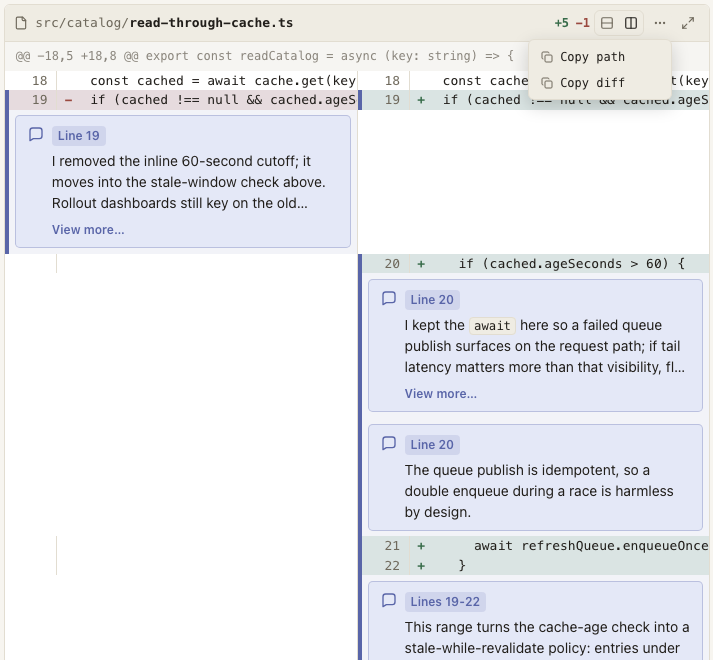
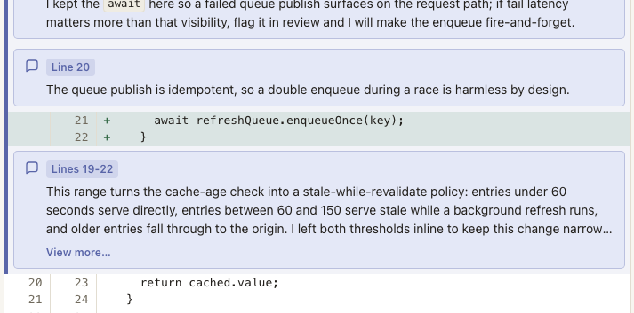

`CodeDiff` renders a unified diff as a first-class review surface: a file header, switchable unified and side-by-side views, optional line-number gutters and change counts, copy actions, and a full-screen dialog.
Its authoring contract is deliberately the one agents already speak: paste one file's unified `git diff` output into a fenced `diff` block.



## Usage

````mdx
<CodeDiff file="src/cache.ts" showLineNumbers showLineCounts>

```diff
@@ -12 +12 @@
-const ttl = 30;
+const ttl = 60;
```

</CodeDiff>
````

## Attributes

| Attribute         | Type               | Required | Behavior                                                                                                                                       |
| ----------------- | ------------------ | -------- | ---------------------------------------------------------------------------------------------------------------------------------------------- |
| `file`            | string (non-empty) | Yes      | Shown in the header (directory muted, filename bold), used by the Copy path action, and names the full-screen dialog for assistive technology. |
| `showLineNumbers` | bare boolean       | No       | Renders old/new line-number gutters computed from `@@` hunk headers.                                                                           |
| `showLineCounts`  | bare boolean       | No       | Shows the computed `+added -removed` summary in the header.                                                                                    |

Attributes take the bare form (`showLineNumbers`, never `showLineNumbers="true"`).
Any other attribute, an empty `file`, or `showLineNumbers` on a diff without `@@` headers is a positional authoring error.

## The diff child

The component takes exactly one fenced ` ```diff ` code block, plus zero or more direct `Annotation` children, and nothing else.
Supported single-file `git diff` output works verbatim: the file preamble (`diff --git`, `index`, `---`, `+++`, mode, rename, and copy lines) is accepted before the first hunk.
Combined and multi-file diffs are not supported; use one `CodeDiff` per file.
Headerless diffs of bare `+`/`-`/context lines are legal when line numbers are not requested.
Inside a hunk, a blank line counts as empty context even when an editor has stripped its leading space.
Malformed lines fail the render with both the document position and the fence-relative line number.
Each `@@` header's declared old and new line counts must match the hunk content, and its coordinates and resulting line-number ranges cannot exceed `9007199254740991`.

## Views

Both views are rendered into the document; switching only changes visibility.
Without JavaScript the reader gets the complete unified view and no dangling controls.
With JavaScript, a two-segment toggle (unified / side-by-side) shows the active view as pressed, and the last choice persists across documents via local storage.
Added and removed lines are tinted, carry `+`/`-` markers, and include visually hidden `Added line:` / `Removed line:` prefixes so the change kind survives without color.

## Header actions

The `...` menu holds `Copy path` and `Copy diff`.
Copy diff reproduces the fence content as MDX parses it: LF line endings with a trailing newline, not the authored bytes.
The menu follows the standard menu-button keyboard pattern: focus moves to the first item on open, arrows and Home/End navigate, Escape closes the menu (without dismissing an enclosing full-screen dialog), and Tab closes it while moving focus naturally.
The expand control at the far right opens the diff alone in a near-viewport modal dialog: Escape or a backdrop click closes it, the page behind cannot scroll while it is open, and closing restores both the component's position and the reader's scroll position.

## Annotations

Nest `Annotation` directly inside `CodeDiff` to anchor a markdown note to specific lines:

```mdx
<Annotation lines="45-46" side="new">
  Slug allocation must follow component rendering.
</Annotation>
```

`lines` (required) is one canonical positive integer or a strictly ascending inclusive range; zero and leading zeros are invalid.
`side` is `old` or `new`, defaulting to `new`.
Every referenced line must exist on the chosen side, and annotations require `@@` hunk headers.
The note renders as a prose card after the range's final line, statically, with a `Line N` / `Lines N-M` badge and `role="note"`.
In unified view the card spans the component; in side-by-side view it renders inside the pane of its `side`, pinned to the visible pane width while the code scrolls.
Covered lines carry the annotation accent as a left spine and a subtle wash blended over their add/remove tints, so ranges read at a glance.
Multiple annotations may target the same line or range and render in authored order.
Long cards gain a progressive `View more` / `View less` disclosure, and the reader's expanded choice survives responsive layout changes; without JavaScript the full content is always present.
Annotation bodies accept prose, lists, inline formatting, and plain fenced code, but reject headings, footnotes, and typed components (each with a positional diagnostic).
An `Annotation` anywhere other than a direct `CodeDiff` child is an unknown component.
`Annotation` is a scoped child component; the planned `CodeSnippet` component will reuse the concept with the same `lines` grammar.



## Design notes

Diff lines render as a grid rather than `pre`/`code`, so the component is never double-processed by syntax highlighting or the fenced-code copy decorator.
The raw diff lives in a hidden `textarea` for the copy action, keeping the visible markup purely presentational.
Wide diffs scroll horizontally inside the component; the page itself never scrolls sideways.
