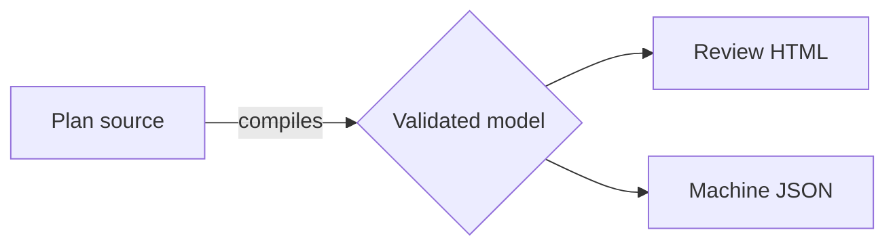

`MermaidDiagram` accepts an explicit Mermaid subset and renders it during compilation. Official Mermaid owns parsing details that are accepted by the subset, text measurement, routing, and geometry; Big Plan owns review anchors, safety checks, and viewer integration.

## When to use it

Use `MermaidDiagram` when the plan needs a general graph—a cycle, merge, fan-in/fan-out, parallel or rank-skipping edges—or one of the supported static Mermaid views such as a sequence, state, class, entity relationship, schedule, journey, timeline, mindmap, pie, or git graph.

Use `FlowDiagram` when stages, comparable cards, and a chronological left-to-right relationship are the point.

## Authoring

````mdx
<MermaidDiagram>



The same graph is available to a human reader and an agent.

</MermaidDiagram>
````

## The contract

- The body contains exactly one fenced `mermaid` block and an optional one-paragraph footer.
- `flowchart` and `graph` accept `TB`, `TD`, `BT`, `RL`, or `LR`. Their nodes have author-written ids and plain-text labels, and their edges may be solid, dotted, thick, open, or cross-ended with an optional label.
- Static rendering also accepts `sequenceDiagram`, `classDiagram`, `stateDiagram`, `stateDiagram-v2`, `erDiagram`, `gantt`, `journey`, `pie`, `mindmap`, `timeline`, and `gitGraph`.
- Subgraphs in flowcharts, Mermaid directives/configuration, style/class statements, click handlers, HTML labels, and unsupported diagram types are rejected with positional diagnostics.

## Reading and marking up a diagram

- Both light and dark SVG variants are embedded in the document. CSS selects one from `data-theme`; theme changes do not rerender Mermaid.
- A diagram's surfaces, borders, text, and edges are delivered as colour roles rather than baked shades, so a compiled diagram follows whichever colour theme the reviewer picks. The alternate node tints some diagram types use have no role of their own and stay fixed.
- Flowchart and graph nodes and edges receive semantic anchors such as `component/MermaidDiagram#1/node/source`. Supported static types use their rendered source labels for stable semantic anchors and accessible names; unlabeled geometry is not exposed as a review target.
- Every type supports whole-figure comments from the toolbar and an optional footer comment. Selectable nodes, relationships, tasks, slices, events, or commits also support element comments and deletion proposals when Mermaid exposes stable target geometry.
- The diagram uses FlowDiagram's zoom steps, percentage readout, Fit, Maximize, roving selection, and comment positioning. Mermaid's runtime is never shipped to the reader.
- The SVG, labels, relationships, and an equivalent figure description remain present when scripts are disabled.

Run `big-plan guidance MermaidDiagram` for authoring judgment guidance.

## Upgrade probe

Mermaid `11.16.0`, Playwright `1.61.1`/Chromium, and the repository-shipped Noto Sans and targeted Noto Sans SC faces are exact rendering pins. The compiler loads and awaits the Latin, Chinese, and symbol glyphs used by the fixture corpus before Mermaid measures text, and the delivered document embeds the same files. Before changing any package or font pin, run the renderer and fixture suites, render `examples/mermaid-gallery.mdx` in both themes, and inspect the semantic anchor assertions and screenshot diffs. Confirm that Chromium is available with `bunx playwright install chromium` and that scripts-off output still contains both the accessible figure text and the selected static SVG. Only then update the pins and commit the resulting lockfile and reviewed visual baselines together.
