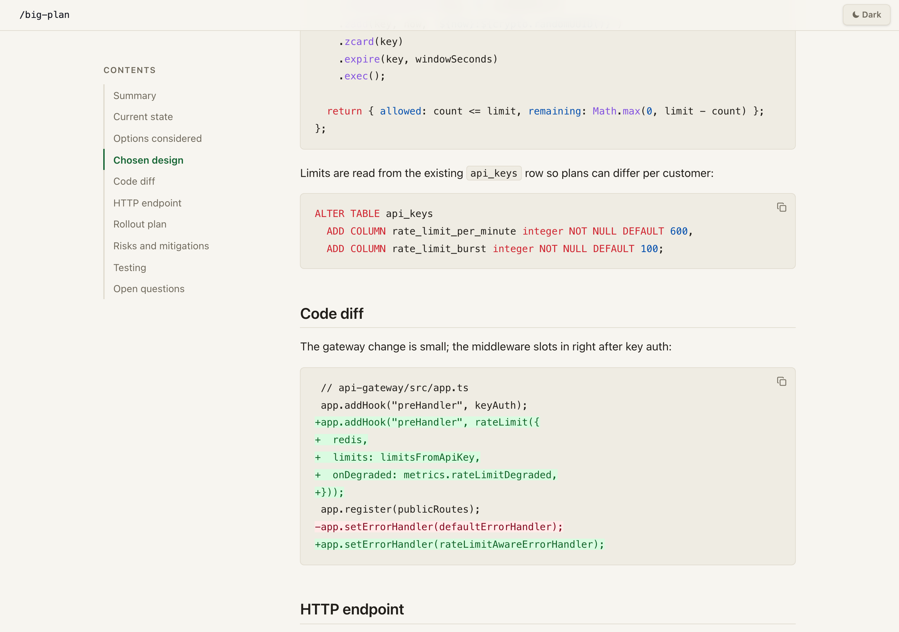
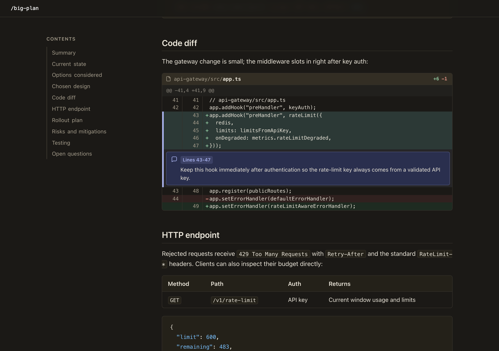

import { Tabs, TabItem } from '@astrojs/starlight/components';

This is what a rendered plan looks like:

<Tabs>
  <TabItem label="Light appearance">
    
  </TabItem>
  <TabItem label="Dark appearance">
    
  </TabItem>
</Tabs>

The viewer follows your OS appearance and uses the `Default` colour theme until you choose otherwise in `Settings`; appearance and colour theme are separate controls.
[See the full rendered plan in your browser.](/demo/)

Some parts of this plan are ordinary Markdown.

But take a look at the **code diff** and the warning under **Risks and mitigations**.
Those use [`CodeDiff`](/components/code-diff/) and [`Callout`](/components/callout/), two of the [typed components](/components/) Big Plan ships for presenting common plan information in a first-class way.
The diff adds line numbers, counts, change coloring, and a line-anchored annotation without asking the agent to design custom HTML.

The output runs locally without a third-party service. The [two-artifact delivery ADR](https://github.com/josh-padnick/big-plan/blob/main/adr/0001-two-artifact-plan-delivery.md) owns the delivery and script-behavior contract.
To see it in action, [install it](/intro/installation/).
