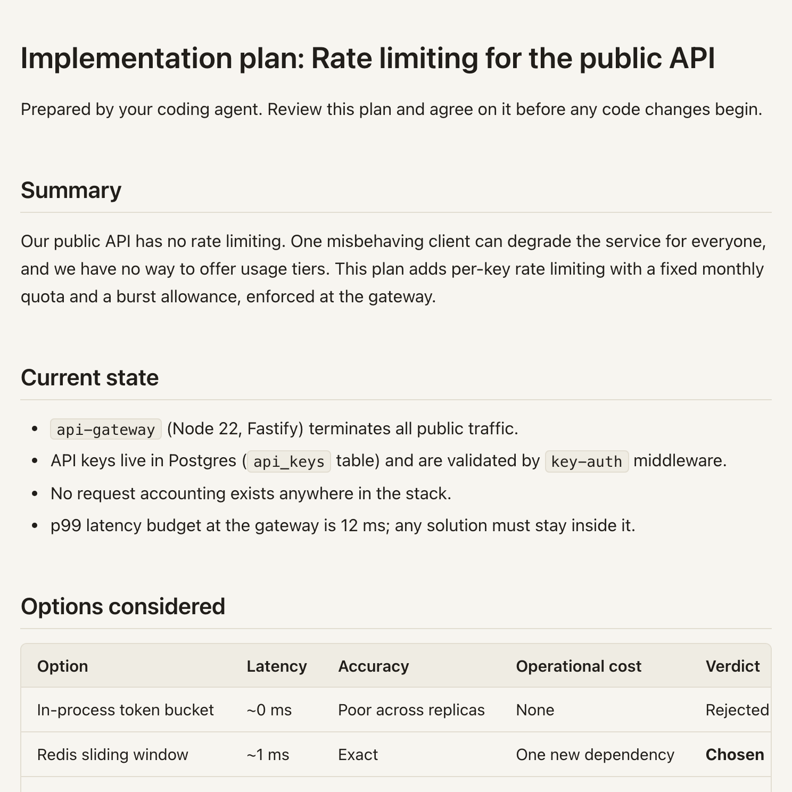

**Goal.** A working `big-plan` you can run, and a rendered plan open in your browser to prove
it.

## Before you start

- **Node.js 22 or newer.** Check with `node --version`. The published package runs under plain
  Node.js, so Bun is not required.
- Nothing else. There is no account, no service to sign up for, and no global install unless
  you want one.

## The fastest install is the one you don't do yourself

Copy this prompt into your coding agent:

```text
Set up Big Plan for me: read https://bigplan.dev/setup.md and follow it.
```

The agent reads the server-controlled setup guide at
[https://bigplan.dev/setup.md](https://bigplan.dev/setup.md), uses the current CLI without
installing it, can install the thin skill shell, adopts the plan-review workflow, and adds the
rule to your project's agent instructions so every future session keeps it.
Authoring principles stay in `big-plan guidance`, so package upgrades refresh them without
hand-editing skill files.

## Or install it yourself

Run it with no install at all:

```sh
# Read how to write a plan humans love to review.
npx -y big-plan@latest guidance
# Turn plan.mdx into a self-contained plan.html review document.
npx -y big-plan@latest render plan.mdx
```

Or install it globally:

```sh
npm install -g big-plan@latest
big-plan guidance
big-plan render plan.mdx
```

Either way, `render` writes `plan.html` next to the input.
Pass a second argument to choose the output path: `big-plan render plan.mdx reviews/plan.html`.

Reading `guidance` first is required; it unlocks `validate`, `render`, and `review` for the
working directory.

## Verify

```sh
npx -y big-plan@latest --version
```

It prints a version. Then take one plan all the way through:

```sh
curl -o plan.mdx https://bigplan.dev/demo/example-plan.md
npx -y big-plan@latest guidance
npx -y big-plan@latest render plan.mdx
```

Open `plan.html` in your browser, and you should see this:



The output is one self-contained HTML file with embedded assets, no external requests, and a
complete reading experience when scripts are disabled.

## If it goes wrong

| What you see                                      | What it means                                                                 | What to do                                                                                                   |
| ------------------------------------------------- | ----------------------------------------------------------------------------- | ------------------------------------------------------------------------------------------------------------ |
| `GUIDANCE_REQUIRED`                               | `render`, `validate`, and `review` are gated                                  | Run `npx -y big-plan@latest guidance` in the same working directory                                          |
| A syntax error from Node                          | Your Node.js is older than 22                                                 | Upgrade Node; check with `node --version`                                                                    |
| `npx big-plan` runs an unexpected version         | An unversioned `npx` run may use a matching package already installed locally | Use `npx -y big-plan@latest`, or pin an exact version                                                        |
| `Cannot render document with invalid MDX`         | The plan has authoring errors                                                 | Every diagnostic is in the `help` entries; see [Fix a validation error](/for-agents/#fix-a-validation-error) |
| The download wrote an HTML page instead of a plan | `curl` followed a redirect or an error page                                   | Check the file starts with `#`, and re-download                                                              |

## Next

[Your first review](/intro/first-review/) — take one plan from download to approval.
