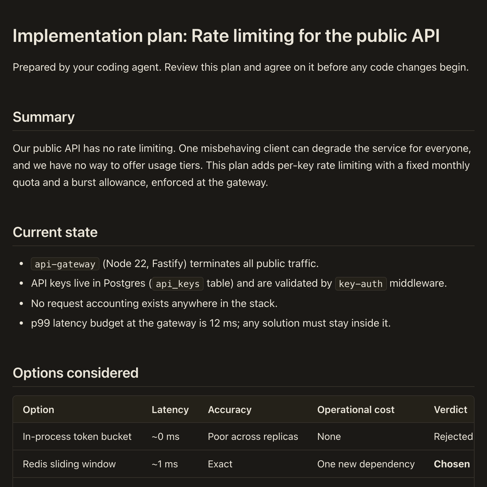

Big Plan turns your agent's markdown plan into a document built for review.
Your agent writes its plan to a file; you render it, read it, and reach real agreement before the agent acts.

This is what a rendered plan looks like, in light mode:

And in dark mode:

The viewer follows your OS preference and remembers your choice when you override it.
[See a rendered plan in your browser.](/demo/)

## How it works

1. Your agent writes its plan to a markdown file.
2. You run `npx big-plan render plan.md`.
3. You open the rendered document and review it.
4. If you want changes, tell the agent; it revises the file, and you render again.

Big Plan works with any agent that can write a file: Claude Code, Codex, Cursor, or your own.

## What you can do

### Read the whole plan without squinting

Stop scrolling walls of markdown in a terminal.

- One themed reading column, in light or dark.
- Section navigation that follows you as you scroll.
- Syntax highlighting and copy controls on every code sample.

### Challenge decisions while they're cheap

Push back on the approach before any code exists, when changing everything costs one comment.

- Review the plan as a document, not a diff.
- Send the agent back to revise, then render again.

### Keep the whole workflow on your disk

Review plans with nothing leaving your machine.

- One self-contained HTML file: no server, no external requests.
- The plan file on your disk stays the source of truth.
- Readable even with JavaScript disabled.

## Today and planned

The static viewer is shipped; see [the viewer](/guides/the-viewer/) for the full reading experience.
Planned: typed [components](/components/), live agent chat, comment threads, and versioned review ([roadmap](/intro/roadmap/)).

## Next step

[Render your first plan in under a minute.](/intro/quickstart/)
