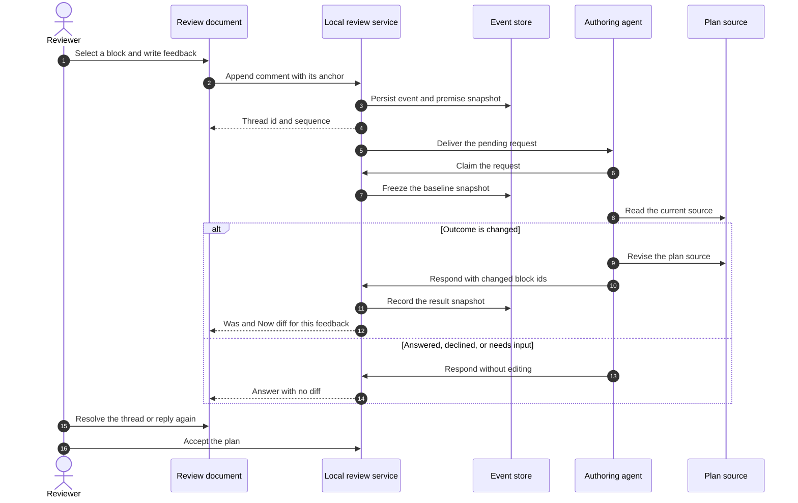

# Causal Diff Gallery

Make every meaningful agent change reviewable at its original place and long after later edits.

<QuickSummary>

<Why>

- Review comments and decisions must survive browser reloads without moving
  plan authority away from the source file.

</Why>

<What>

- Add a local review service, a durable event table, and one operator-facing
  review queue.

</What>

<How>

- Land persistence first, expose narrow service contracts, then enable the
  review workspace behind a rollout flag.

</How>

</QuickSummary>

<TableOfContents>
<Entry section="What this experience does" gist="Explain the causal review promise" />
<Entry section="Delivery contract" gist="Define snapshots, outcomes, and review locations" />
<Entry section="Rollout" gist="Sequence the first release" />
<Entry section="Review decisions" gist="Settle ownership, storage, and rollout boundaries" />
<Entry section="System shape" gist="Show the service flow and planned file changes" />
<Entry section="Service contracts" gist="Review code, data, table, HTTP, GraphQL, and gRPC contracts" />
<Entry section="Desired experience" gist="Preview the queue used to resolve review threads" />
</TableOfContents>

## What this experience does

This is a causal diff review experience: it shows reviewers the exact Was and Now content beside each place an agent changed, and ties each change back to the feedback that caused it.

- Thread answers carry only the changes your own feedback caused, and nothing more.
- Chat answers carry a grouped, plan-wide change digest.
- Historical answers preserve their claim-time baseline and result snapshots.
- A guided tour moves through every changed place without losing context.

<Callout type="note" title="Review note">

Verify the causal boundary, the in-place lens, and the historical state.

</Callout>

## Delivery contract

*Each answer includes the evidence that led to its declared outcome.*

| Where reviewers see it | Evidence shown | Baseline it compares against |
| ---------------------- | -------------- | ---------------------------- |
| Feedback thread | Was/Now diff attributed to that feedback | Baseline frozen when the agent claimed the request |
| Plan-wide chat | Grouped change digest and guided tour | Baseline frozen when the agent claimed the chat request |
| New plan | Current source plus historical diffs | Each answer's own result snapshot, kept after later edits |
| Feedback on an older plan version | Stale badge and premise-to-current diff | Premise captured when that feedback was written |

Each declared outcome carries its own evidence, and only one of them attaches a diff.

| Outcome | What the agent did | Evidence attached |
| ------- | ------------------ | ----------------- |
| answered | Explained without revising the plan | None |
| changed | Revised the plan source | Was/Now diff for every changed block |
| needs-input | Asked the reviewer to decide | None, and the thread stays open |
| declined | Refused the revision on principle | None |

```ts
// What the agent declared for one review request.
// Only "changed" attaches a diff; the rest answer without revising the plan.
type Outcome = "answered" | "changed" | "needs-input" | "declined";

// The plan states one exchange compares, each captured at a different moment.
type SnapshotExchange = {
  // The plan as it stood when the reviewer wrote the feedback.
  premiseSnapshot: string;
  // The plan frozen when the agent claimed the request, so a diff cannot drift.
  // Absent until the request is claimed.
  baselineSnapshot?: string;
  // The plan after the agent answered: the Now side of every attributed diff.
  resultSnapshot: string;
};
```

## Rollout

The first release enables the full experience for every local reviewer.

1. Freeze the baseline when the agent claims the request.
2. Capture the premise when feedback is authored.
3. Attach the result snapshot to the answer.
4. Tour grouped changed places in the live document.

<Part title="Context and choices" />

## Review decisions

*The remaining choices set the persistence and rollout boundaries.*

<Callout type="note" title="Captain review">

Approve the persistence boundary and staged rollout before implementation
begins. The browser remains a review surface; the MDX plan on disk remains
authoritative.

</Callout>

<Decision question="Where should review-event persistence live?">

The first release runs locally, but the storage boundary should admit shared
review later.

<Option title="Review service repository" recommended summary="Keep persistence behind the service contract.">

<Consideration label="Source authority" verdict="Preserved" tone="good">

The service stores feedback and decisions, never a competing copy of the plan.

</Consideration>

<Consideration label="Migration path" verdict="Contained" tone="good">

A later shared service can retain the same repository interface.

</Consideration>

</Option>

<Option title="Plan-adjacent files on disk" summary="Write review events beside the plan under a dot directory.">

<Consideration label="Source authority" verdict="Preserved" tone="good">

Review records sit next to the plan without competing with it, and a reviewer
can inspect them with ordinary file tools.

</Consideration>

<Consideration label="Migration path" verdict="Manual" tone="mixed">

A shared service would have to import loose per-plan files and invent the
ordering guarantees the format never enforced.

</Consideration>

</Option>

</Decision>

<QuickDecision question="Ship the workspace behind a local feature flag?">

<Option title="Yes" recommended summary="Lets maintainers exercise the full review loop before it becomes the default." />

<Option title="No" summary="Reduces rollout code but exposes every local user at once." />

</QuickDecision>

<DecisionAnalysis question="Which event store should back the first release?" state="proposed" interaction="audit">

The store must preserve thread order, anchor updates, and crash-safe writes.

<Criterion title="Atomic review updates">

A thread event and its latest anchor must commit together.

</Criterion>

<Criterion title="Local setup">

Contributors should not need a separately managed database service.

</Criterion>

<Option title="SQLite" recommended summary="Use one embedded database owned by the review service.">

<Score criterion="Atomic review updates" verdict="Strong" tone="good">

Transactions cover the event and anchor rows in one file.

</Score>

<Score criterion="Local setup" verdict="No setup" tone="good">

The service opens the database directly.

</Score>

</Option>

<Option title="PostgreSQL" summary="Run the same server store planned for shared review.">

<Score criterion="Atomic review updates" verdict="Strong" tone="good">

Relational transactions provide the required boundary.

</Score>

<Score criterion="Local setup" verdict="Extra service" tone="mixed">

Every contributor must start and maintain a database server.

</Score>

</Option>

<Reversibility rating="somewhat-hard">

The repository seam contains the code change, but persisted local data still
needs a migration.

</Reversibility>

</DecisionAnalysis>

<Part title="Architecture" />

## System shape

*How one authoritative plan reaches the service, browser, and authoring agent.*

<FlowDiagram>

<Stage title="Author">
<Node id="plan-source" label="Plan source" code="plans/review-rollout.mdx" tone="source" />
</Stage>

<Stage title="Review">
<Node id="review-service" label="Local service" code="src/review/service.ts" />
</Stage>

<Stage title="Consume">
<Node id="browser" label="Review document" tone="destination" />
<Node id="agent" label="Authoring agent" tone="destination" />
</Stage>

<Edge from="plan-source" to="review-service" label="opens" />
<Edge from="review-service" to="browser" label="serves" />
<Edge from="review-service" to="agent" label="notifies" />

One source file, one feedback stream, and two coordinated readers.

</FlowDiagram>

*Review acceptance can also cycle a plan back to its source before execution begins.*

<MermaidDiagram>



One reviewer comment, from selection through the agent's outcome and back to the
document as attributed evidence.

</MermaidDiagram>

<FileTree title="Review module layout">

```tree
src/
  review/
    service.ts - Coordinates plan reads and review events.
    repository.ts - Owns durable event transactions.
    anchors.ts - Reconciles selections after source edits.
  render/
    shell/
      viewer-script.ts - Sends review actions to the local service.
data/
  review.sqlite - Local event store the repository opens.
  example-review-events.jsonl - One exported thread stream, newest event last.
  example-anchors.json - Anchor records for that stream, before and after edits.
samples/
  thread-open.json - One unresolved thread with two replies.
  thread-resolved.json - The same thread after an accept event.
  anchors-edited-source.json - Selections replayed against an edited plan.
```

</FileTree>

<FileTreeDiff title="Planned changes">

```tree
src/
  review/ [added] - New review-service vertical slice.
    service.ts [added] - Coordinates review workflows.
    repository.ts [added] - Persists ordered events.
  render/
    shell/
      viewer-script.ts [modified] - Connect review controls.
test/
  review-service.spec.ts [added] - Exercises the durable browser journey.
docs/
  review-workflow.md [added] - Explains the local review loop.
```

</FileTreeDiff>

<Part title="Implementation contracts" />

## Service contracts

*The code, storage, and transport contracts that make review events durable.*

<CodeSnippet file="src/review/service.ts" startLine="18" showLineNumbers>

```ts
export const appendReviewEvent = async (
  command: AppendReviewEvent,
): Promise<ReviewThread> =>
  repository.transaction((tx) => tx.append(command));
```

<Annotation lines="21">

The service owns the transaction boundary so every transport receives the same
ordering and anchor guarantees.

</Annotation>

</CodeSnippet>

<CodeDiff file="src/render/shell/viewer-script.ts" showLineNumbers showLineCounts>

```diff
diff --git a/src/render/shell/viewer-script.ts b/src/render/shell/viewer-script.ts
index 8af2711..47d20f9 100644
--- a/src/render/shell/viewer-script.ts
+++ b/src/render/shell/viewer-script.ts
@@ -412,2 +412,6 @@ const saveDraft = async () => {
-  sessionStorage.setItem(draftKey, body);
+  await reviewClient.append({
+    planId,
+    body,
+    selection: currentSelection(),
+  });
 };
```

<Annotation lines="414-417" side="new">

Persist the comment and its current selection together; acknowledging either
one alone would create an event the authoring agent cannot safely apply.

</Annotation>

</CodeDiff>

<DatabaseTableSchema name="review.review_events">

```dbml
id          bigint      [pk, increment]
plan_id     text        [not null]
thread_id   text        [not null]
kind        text        [not null, note: 'comment | reply | resolve | accept']
body        text
anchor_json text
created_at  timestamptz [not null, default: `now()`]

indexes {
  (plan_id, thread_id, id) [name: 'review_events_thread_idx']
}

Note: 'Append-only review events in durable thread order.'
```

</DatabaseTableSchema>

<DataTable title="Rollout gates" filter>

<Column name="Error budget" type="number" align="right" />

```table
| Gate | Owner | Error budget | Evidence |
| --- | --- | ---: | --- |
| Event durability | Service | 0 | Crash-recovery integration test |
| Anchor reconciliation | Renderer | 1 | Edited-source replay fixture |
| Workspace rollout | Product | 2 | Maintainer dogfood sessions |
```

</DataTable>

<HttpEndpoint method="POST" path="/api/plans/{planId}/review-events" summary="Append one review event" auth="Local review session">

Persists one ordered event and its current source anchor in the same
transaction. Clients use `clientEventId` to retry safely after a lost response.

<Param name="planId" in="path" type="string" required>

Stable identifier for the authoritative plan source.

</Param>

<Param name="threadId" in="body" type="string" required>

Thread receiving the event.

</Param>

<Param name="clientEventId" in="body" type="string" required>

Client-generated idempotency key for this append attempt.

</Param>

<Param name="kind" in="body" type="comment | reply | resolve | accept" required>

Review action represented by the event.

</Param>

<Param name="body" in="body" type="string">

Comment or reply text. Omitted for resolve and accept events.

</Param>

<Param name="anchor" in="body" type="SourceAnchor">

Source location the event refers to, captured against the current plan
revision.

</Param>

<Request contentType="application/json">

```json
{
  "threadId": "thr_01K1Q8WZ3B4N6M7P9R2T5V8X0Y",
  "clientEventId": "evt_client_01K1Q91C8Y2F6G4H7J3M5N0PQS",
  "kind": "comment",
  "body": "Keep the retry budget explicit in the service contract.",
  "anchor": {
    "path": "src/render/shell/viewer-script.ts",
    "startLine": 414,
    "endLine": 417,
    "planRevision": "sha256:7a1d56c4"
  }
}
```

</Request>

<Response status="201" label="Review event appended">

```json
{
  "eventId": "evt_01K1Q91DD5Z8A2B4C6E7F9G0HJ",
  "threadId": "thr_01K1Q8WZ3B4N6M7P9R2T5V8X0Y",
  "sequence": 7,
  "status": "open",
  "createdAt": "2026-08-05T19:42:11.392Z"
}
```

</Response>

<Response status="409" label="Thread changed before append">

```json
{
  "error": "thread_sequence_conflict",
  "expectedSequence": 6,
  "currentSequence": 7
}
```

</Response>

<Response status="422" label="Source anchor is invalid">

```json
{
  "error": "invalid_source_anchor",
  "field": "anchor.startLine",
  "message": "startLine must exist in plan revision sha256:7a1d56c4"
}
```

</Response>

</HttpEndpoint>

<GraphqlOperation kind="mutation" name="reviewEventAppend" access="Requires plan write access" />

<GrpcMethod service="bigplan.v1.ReviewService" name="WatchReviewEvents" request="WatchReviewEventsRequest" response="ReviewEvent" kind="serverStreaming" />

<Part title="Human validation" />

<Slide type="desired-experience" />

## Operator workspace

The operator opens unresolved threads, sees the selected plan excerpt, and
records a resolution without leaving the review queue.

<Wireframe id="review-queue" title="Local review queue">

<Screen id="queue" name="Review queue" device="desktop" url="/plans/cache-rollout/review">

<AppShell>

<Sidebar brand="Big Plan" mode="Local review">

<Nav label="Review">
<NavItem label="Open threads" active />
<NavItem label="Resolved" />
</Nav>

</Sidebar>

<AppContent>

<PageHeader title="Plan review">
<Badge label="3 open" tone="warning" />
<Button label="Accept plan" emphasis="primary" />
</PageHeader>

<Row gap="md">

<Panel title="Threads" surface="filled">
<List>
<ListItem label="Keep the retry budget explicit" meta="Code change" selected />
<ListItem label="Clarify the migration owner" meta="Decision" />
<ListItem label="Add the rollback query" meta="Rollout" />
</List>
</Panel>

<Rail>
<Panel title="Selected thread" surface="outlined">
<Text text="Keep the retry budget explicit." />
<Text text="viewer-script.ts · lines 414–417" role="helper" />
<Button label="Resolve thread" />
</Panel>
</Rail>

</Row>

</AppContent>

</AppShell>

</Screen>

</Wireframe>

The plan is ready to execute when every gate has an owner, every unresolved
thread has a verdict, and the reviewer explicitly accepts the plan.
