# MermaidDiagram gallery

This gallery exercises the accepted Mermaid surface: semantic flowchart directions, node shapes, edge styles, graph structures, long labels, Unicode, realistic plan excerpts, and every supported static diagram type.

## Directions and shapes

### Top to bottom

#### A top-to-bottom graph keeps the decision branch visible

<MermaidDiagram>

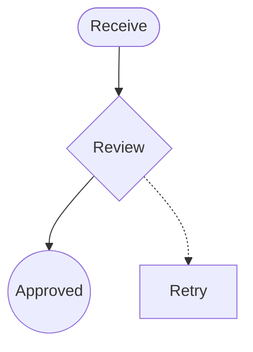

The decision branch remains visible in the static figure.

</MermaidDiagram>

### Top down

#### A top-down graph shows a short build path

<MermaidDiagram>

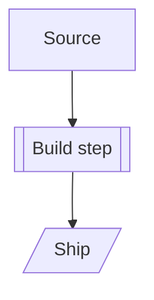

</MermaidDiagram>

### Bottom to top

#### A bottom-up graph makes validation lead to source data

<MermaidDiagram>

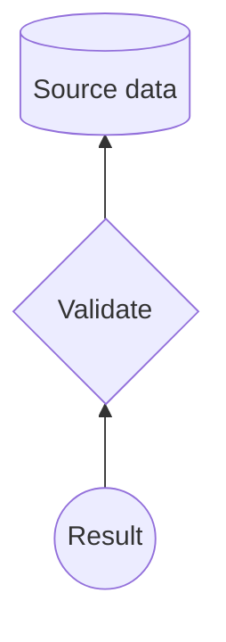

</MermaidDiagram>

### Right to left

#### A right-to-left graph reverses the reading direction

<MermaidDiagram>

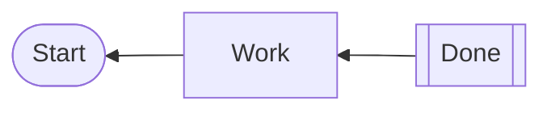

</MermaidDiagram>

### Node shapes

#### One graph exercises the supported node shapes

<MermaidDiagram>

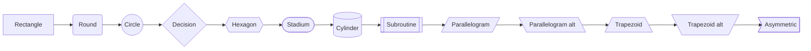

Node ids are never shown as a second card line; the authored label is the content.

</MermaidDiagram>

## Edges and graph structure

### Edge styles and labels

#### Edge paint and labels distinguish relationship types

<MermaidDiagram>

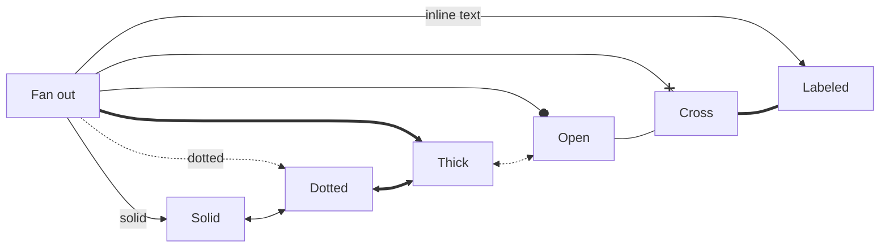

</MermaidDiagram>

### Fan-in, fan-out, cycles, and parallel edges

#### A review graph combines branching, merging, cycles, and parallel edges

<MermaidDiagram>

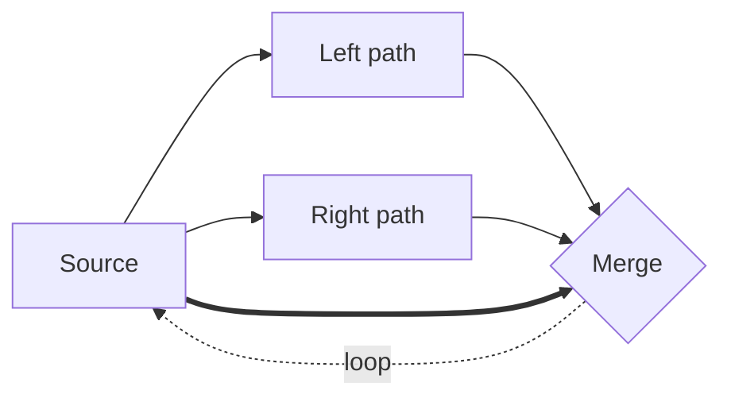

The graph contains a cycle, fan-out, fan-in, and parallel paths between the same endpoints.

</MermaidDiagram>

### Rank skipping and long labels

#### A wide graph tests rank skipping, long labels, and Unicode

<MermaidDiagram>

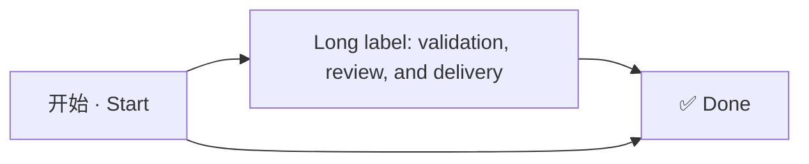

The direct edge skips the middle rank; Fit and Maximize keep the wide result reviewable.

</MermaidDiagram>

## Realistic plan excerpts

### Compile and deliver

#### A realistic plan graph connects source, compilation, and delivery

<MermaidDiagram>

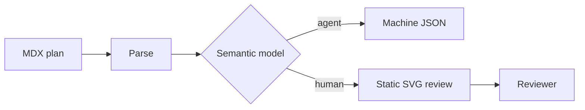

</MermaidDiagram>

### Review feedback loop

#### A realistic review graph closes the feedback loop

<MermaidDiagram>

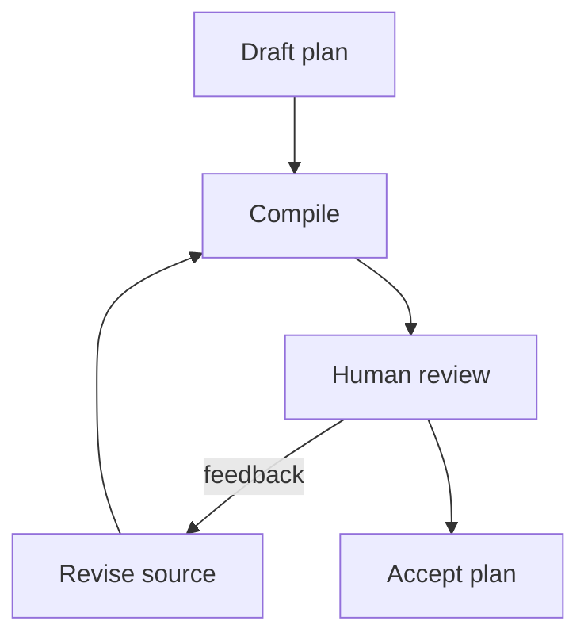

</MermaidDiagram>

### Rejected syntax, shown as source text

The following cases are intentionally not compiled. They demonstrate the diagnostics an author receives:

````text
<MermaidDiagram>
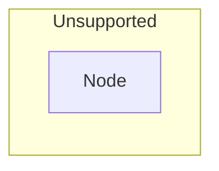
</MermaidDiagram>
````

Big Plan reports that subgraphs are not supported in v1 and asks the author to use explicit nodes and edges instead. The unsupported `zenuml` example below receives the unsupported-type diagnostic.

## Static Mermaid type gallery

The compile-time renderer also accepts these Mermaid types. They are shipped as
sanitized light and dark SVGs with no Mermaid runtime in the review document.
Every supported type has a stable figure anchor and footer target. Where
Mermaid exposes identifiable static geometry, Big Plan also adds review targets:
sequence participants and messages, class/state/ER nodes and labeled relationships,
Gantt and journey tasks, pie slices, mindmap nodes, timeline events, and git
graph commits. Flowchart and graph keep the richer semantic node/edge model;
these static types derive anchors and accessible names from source labels and
leave unlabeled geometry out of the review target set.

### Sequence

#### A sequence keeps the review handoff visible

<MermaidDiagram>

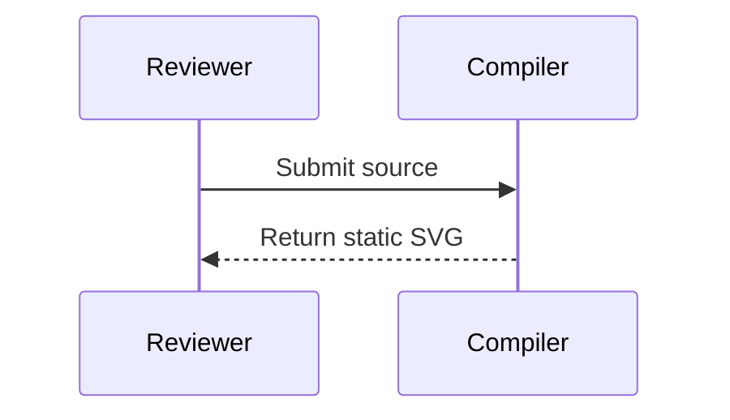

Participants and messages are selectable; the whole diagram and footer are also
commentable.

</MermaidDiagram>

### Class

#### A class diagram makes the compile boundary concrete

<MermaidDiagram>

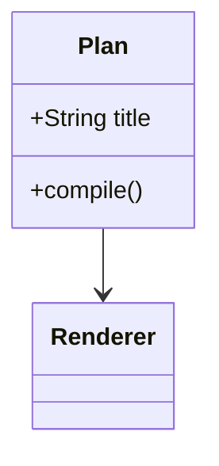

</MermaidDiagram>

Class boxes are selectable. Unlabelled relationships remain visible in the
static SVG, while the whole diagram and footer remain figure-level targets.

### State

#### A state diagram shows the review lifecycle

<MermaidDiagram>

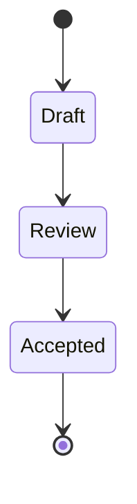

</MermaidDiagram>

States are selectable. Unlabelled transitions remain visible in the static SVG,
while the whole diagram and footer remain figure-level targets.

### Entity relationship

#### An entity relationship diagram shows review records

<MermaidDiagram>

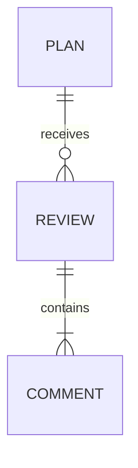

</MermaidDiagram>

Entities and relationships are selectable; the whole diagram and footer remain
available as figure-level targets.

### Gantt

#### A Gantt chart makes the delivery window legible

<MermaidDiagram>

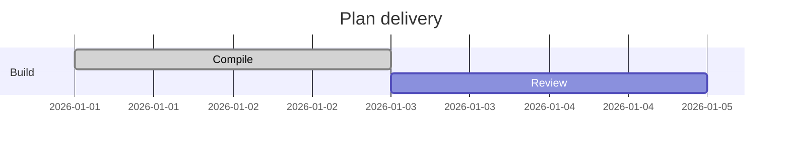

</MermaidDiagram>

Gantt tasks are static SVG geometry; the whole diagram and footer are
commentable.

### Pie

#### A pie chart shows where review effort goes

<MermaidDiagram>

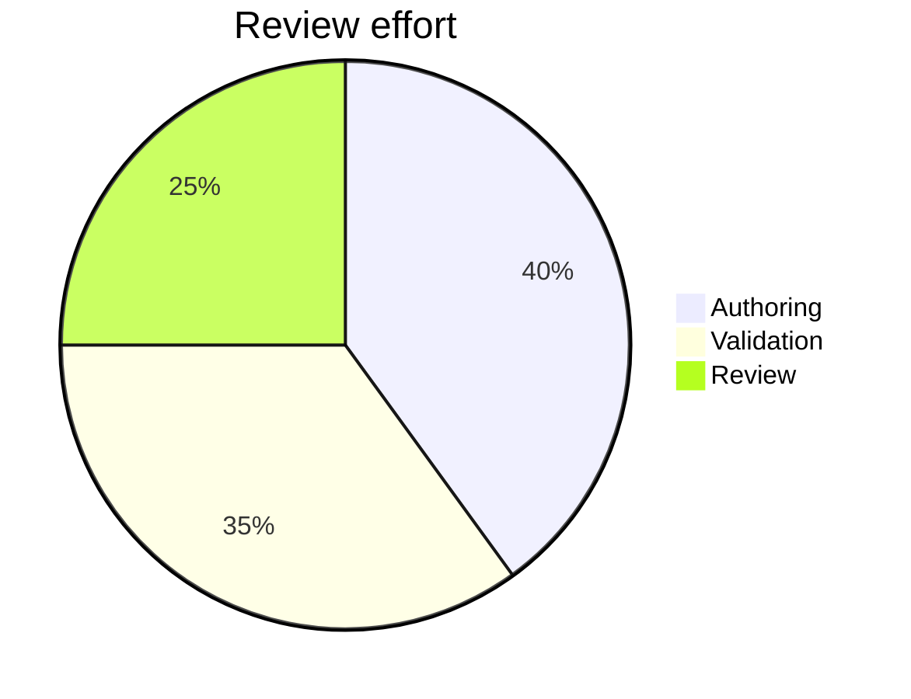

</MermaidDiagram>

Pie slices are selectable; the whole diagram and footer remain available as
figure-level targets.

### User journey

#### A journey follows a reviewer through the plan

<MermaidDiagram>

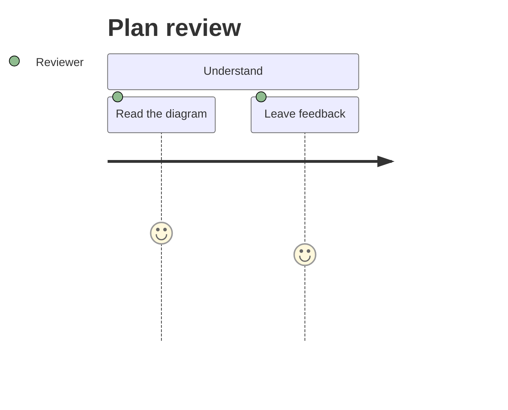

</MermaidDiagram>

Journey tasks are selectable; the whole diagram and footer remain available as
figure-level targets.

### Mindmap

#### A mindmap groups the plan's source and output

<MermaidDiagram>

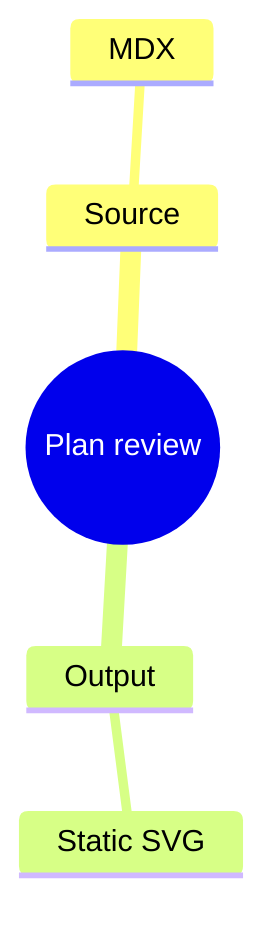

</MermaidDiagram>

Mindmap nodes are selectable; the whole diagram and footer remain available as
figure-level targets.

### Timeline

#### A timeline records the renderer release

<MermaidDiagram>

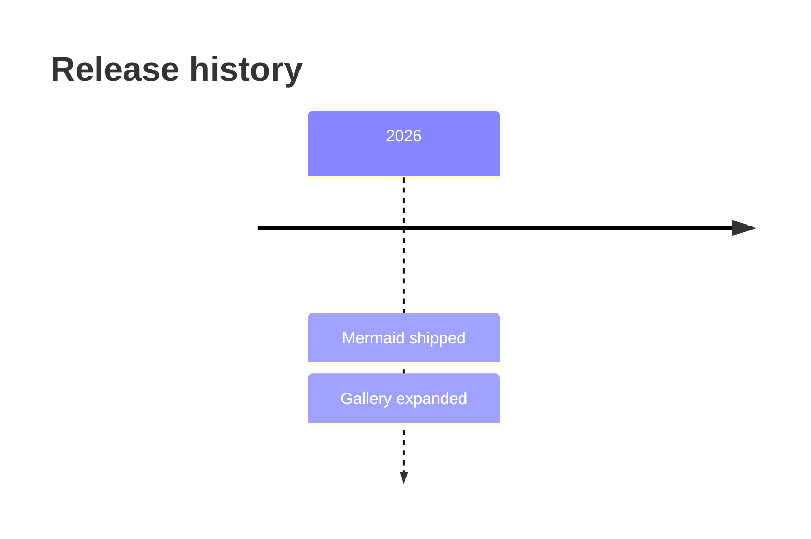

</MermaidDiagram>

Timeline events are selectable; the whole diagram and footer remain available
as figure-level targets.

### Git graph

#### A git graph shows the gallery branch

<MermaidDiagram>

```mermaid
gitGraph
  commit id: "base"
  branch review
  checkout review
  commit id: "gallery"
```

</MermaidDiagram>

Commits are selectable. Unlabelled graph edges remain visible in the static SVG,
while the whole diagram and footer remain figure-level targets.

ZenUML is intentionally shown as text rather than compiled: Mermaid 11.16.0
does not ship a ZenUML renderer, and Big Plan does not add a separate runtime.

~~~~text
<MermaidDiagram>
```mermaid
zenuml
  Alice->Bob: Hello
```
</MermaidDiagram>
~~~~
